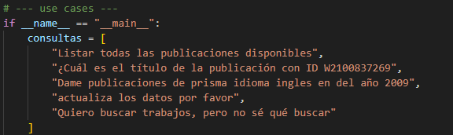

# AgentETLKitsune
# Instrucciones de instalación y uso

Este proyecto implementa un flujo **ETL → API REST → Agente de IA**, que permite:
- Extraer publicaciones de la API pública de OpenAlex.
- Guardarlas en una base de datos PostgreSQL.
- Consultarlas a través de una API construida en FastAPI.
- Interactuar en lenguaje natural mediante un agente basado en un modelo de lenguaje.


1. **Clonar el repositorio**
   ```bash
   git clone https://github.com/jyarac/AgentETLKitsune
   cd AgentETLKitsune

2. **Crear un entorno virtual**
   Esta prueba fue realizada en un entorno Windows, por tanto las instrucciones
   estan hechas para Windows

   Crear entorno virtual en la raiz del proyecto e instalar dependencias
   
   ```bash
   python -m venv venv
   venv\Scripts\activate

   pip install -r requirements.txt
4. Crear archivo .env en la raiz del repositorio con los siguientes parametros
    ```ini
    DB_HOST=localhost
    DB_NAME=mi_base
    DB_USER=mi_usuario
    DB_PASS=mi_password
    DB_PORT=5432
    OPENAI_API_KEY=tu_clave_openai
    MAIL=correopara@openalex.com
    API_TOKEN=token_sencillo
5. Hacer una primera ingesta de datos
Antes de usar el agente y la api, ejecuta el archivo ETL.py para hacer una primera ingesta de datos
    ```bash
    python api/api.py

6. Encender la API
    ```bash
    cd api
    uvicorn main:app --reload
7. Probar el agente
    ```bash
    python agent/agent.py

para ejecutar consultas personalizadas es necesario cambiar las consultas que vienen por defecto en el condicional del script:



